# Architecture Documentation

## Table of Contents

- [System Architecture](#system-architecture)
- [Component Diagram](#component-diagram)
- [Data Flow](#data-flow)
- [Database Schema](#database-schema)
- [API Architecture](#api-architecture)
- [Workflow Execution Flow](#workflow-execution-flow)
- [Deployment Architecture](#deployment-architecture)

---

## System Architecture

### High-Level Architecture

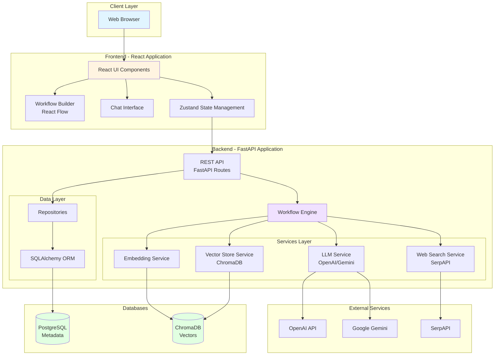

---

## Component Diagram

### Frontend Components

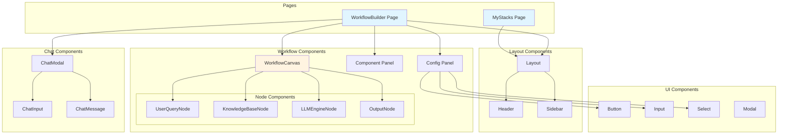

### Backend Services

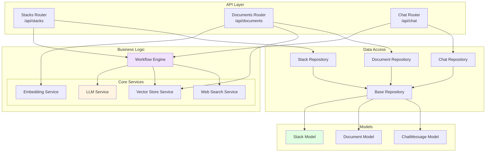

---

## Data Flow

### Workflow Creation and Execution

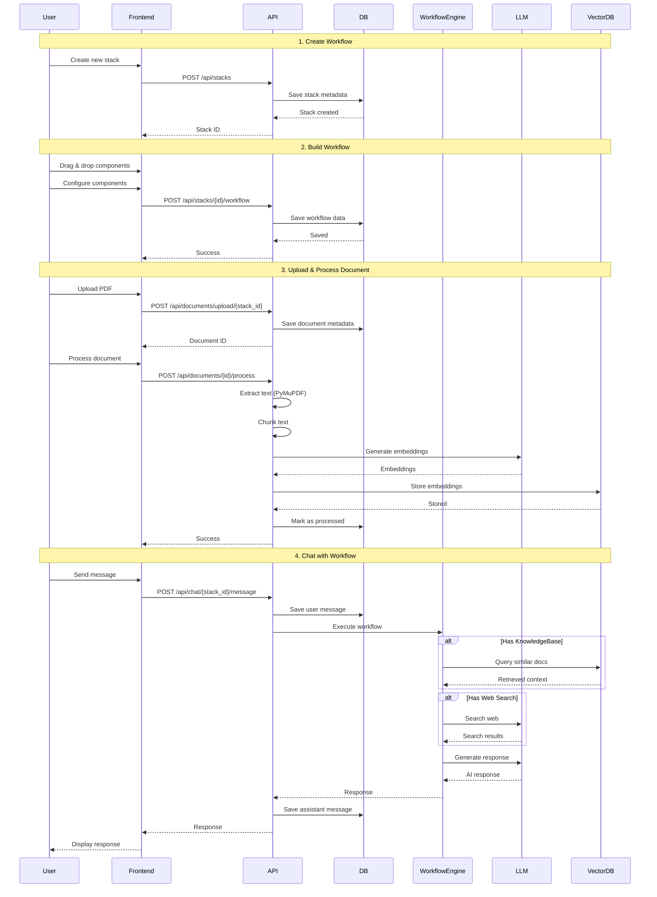

### Document Processing Flow

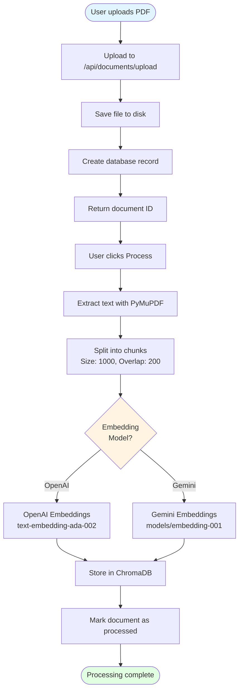

---

## Database Schema

### Entity Relationship Diagram

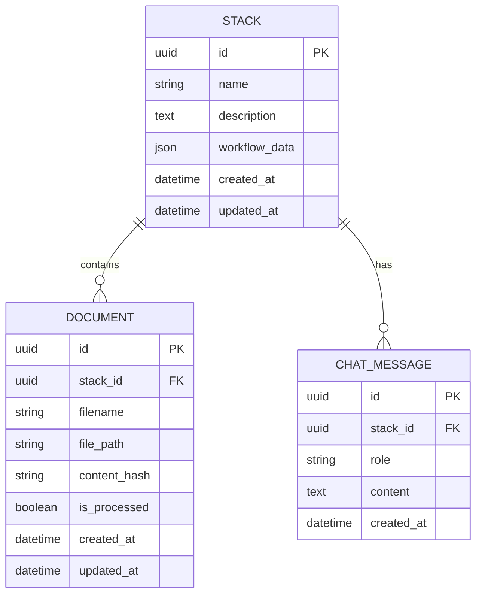

### Schema Details

#### stacks table
- **id** (UUID, PK): Unique identifier
- **name** (VARCHAR): Stack name
- **description** (TEXT): Stack description
- **workflow_data** (JSON): Stores nodes and edges
  ```json
  {
    "nodes": [
      {
        "id": "node-1",
        "type": "userQuery",
        "position": {"x": 100, "y": 100},
        "data": {}
      }
    ],
    "edges": [
      {
        "id": "edge-1",
        "source": "node-1",
        "target": "node-2"
      }
    ]
  }
  ```
- **created_at** (TIMESTAMP): Creation timestamp
- **updated_at** (TIMESTAMP): Last update timestamp

#### documents table
- **id** (UUID, PK): Unique identifier
- **stack_id** (UUID, FK): Reference to stack
- **filename** (VARCHAR): Original filename
- **file_path** (VARCHAR): Path on disk
- **content_hash** (VARCHAR): SHA-256 hash for deduplication
- **is_processed** (BOOLEAN): Processing status
- **created_at** (TIMESTAMP): Upload timestamp
- **updated_at** (TIMESTAMP): Last update timestamp

#### chat_messages table
- **id** (UUID, PK): Unique identifier
- **stack_id** (UUID, FK): Reference to stack
- **role** (VARCHAR): 'user' or 'assistant'
- **content** (TEXT): Message content
- **created_at** (TIMESTAMP): Message timestamp

---

## API Architecture

### RESTful Endpoints

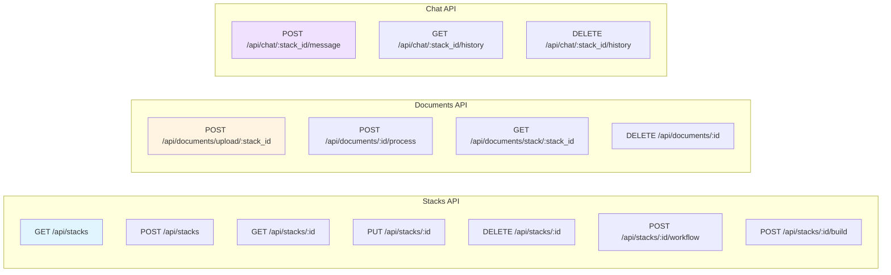

### API Response Format

All API responses follow a consistent format:

**Success Response:**
```json
{
  "success": true,
  "data": { ... },
  "message": "Operation completed successfully"
}
```

**Error Response:**
```json
{
  "success": false,
  "error": {
    "code": "ERROR_CODE",
    "message": "Human-readable error message"
  }
}
```

---

## Workflow Execution Flow

### Execution Order Determination

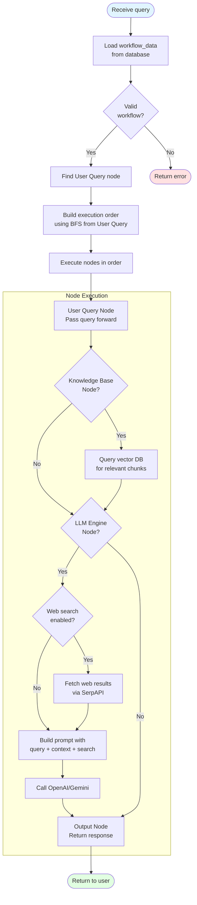

### Context Building

The workflow engine builds context from multiple sources:

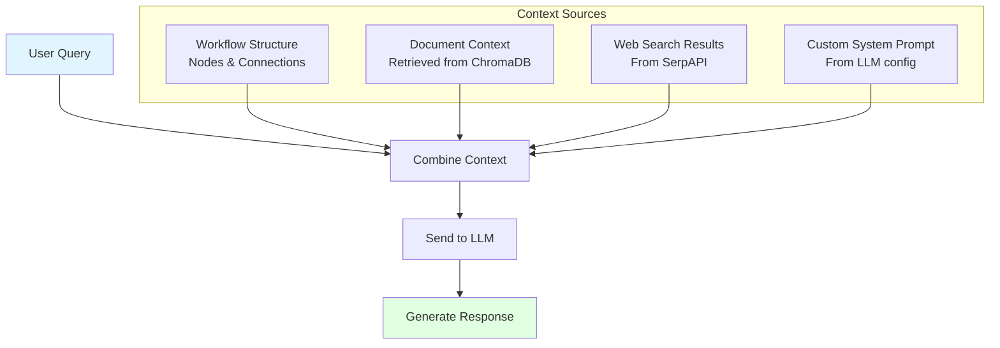

---

## Deployment Architecture

### Docker Compose Deployment

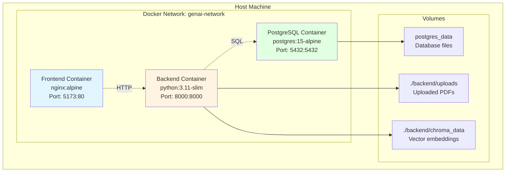

### Kubernetes Deployment (Optional)

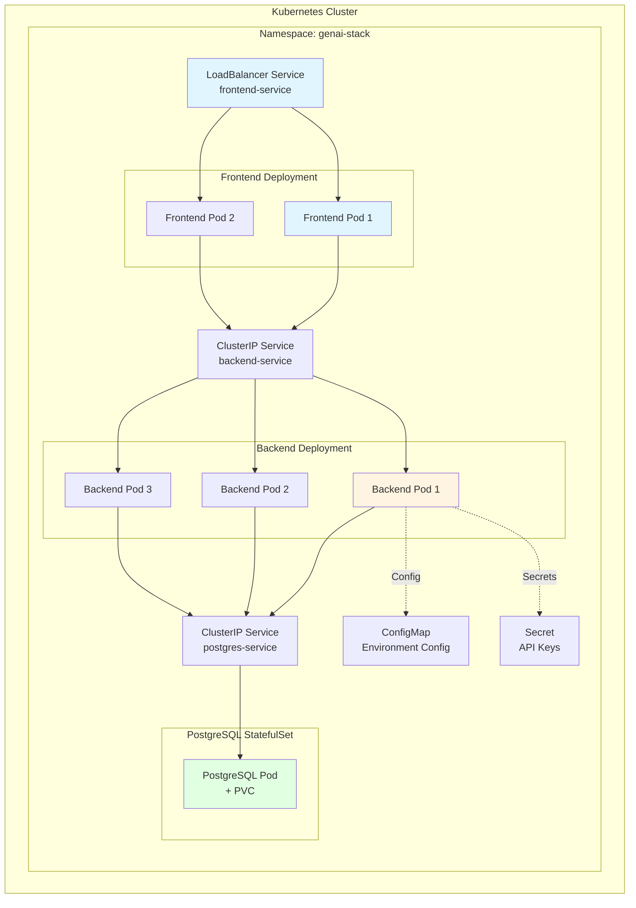

---

## Technology Stack Details

### Frontend Technology Choices

| Technology | Purpose | Why Chosen |
|------------|---------|------------|
| **React 19** | UI Framework | Modern, component-based, extensive ecosystem |
| **TypeScript** | Type Safety | Catch errors at compile-time, better IDE support |
| **React Flow** | Workflow Canvas | Purpose-built for node-based UIs, excellent DX |
| **Zustand** | State Management | Lightweight, simple API, no boilerplate |
| **Vite** | Build Tool | Fast HMR, modern ESM-based, optimized builds |
| **TailwindCSS** | Styling | Utility-first, rapid development, consistent design |
| **Axios** | HTTP Client | Promise-based, interceptors, request cancellation |

### Backend Technology Choices

| Technology | Purpose | Why Chosen |
|------------|---------|------------|
| **FastAPI** | Web Framework | Fast, async, automatic OpenAPI docs, type hints |
| **SQLAlchemy** | ORM | Mature, flexible, supports migrations |
| **Pydantic** | Validation | Type-safe data validation, integrates with FastAPI |
| **ChromaDB** | Vector Store | Embedded, simple API, efficient similarity search |
| **PyMuPDF** | PDF Processing | Fast, accurate text extraction, well-maintained |

---

## Security Considerations

### API Key Management
- All API keys stored in environment variables
- Never committed to version control
- Separated between development and production

### Database Security
- Passwords managed via environment variables
- Connection pooling with limits
- SQL injection prevention via ORM

### File Upload Security
- File type validation (PDF only)
- File size limits
- Content hash for deduplication
- Isolated upload directory

### CORS Configuration
- Configured for specific origins in production
- Development allows localhost

---

## Performance Considerations

### Frontend Optimization
- Code splitting for lazy loading
- React.memo for expensive components
- Debounced API calls
- Optimized re-renders

### Backend Optimization
- Async/await for I/O operations
- Database connection pooling
- Efficient vector similarity search
- Chunked document processing

### Caching Strategy
- Browser caching for static assets
- API response caching (future enhancement)
- Vector store persistent storage

---

## Monitoring and Observability

### Logging
- Structured logging format
- Request/response logging
- Error tracking with stack traces
- Performance metrics

### Health Checks
- `/api/health` endpoint
- Database connectivity check
- Vector store availability

### Metrics (Optional)
- Request latency
- Error rates
- LLM API usage
- Database query performance

---

**Next Steps**: For deployment instructions, see [DEPLOYMENT.md](./DEPLOYMENT.md)
